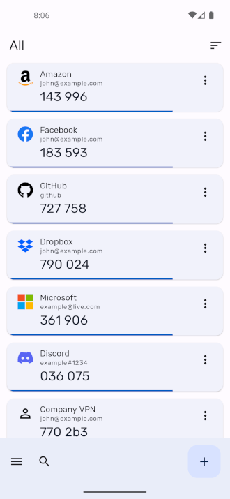

# Authenticator Pro


Authenticator Pro is a free open-source two factor authentication app for Android.

It supports TOTP (Time Based) and HOTP (Counter Based) authenticators using either SHA1, SHA256 or SHA512 hashing algorithms.

View some supported providers here: [Two Factor Auth List](https://twofactorauth.org/) (marked with "software token")

The app is written in C# with Xamarin Android.

## Download

[](https://play.google.com/store/apps/details?id=me.jmh.authenticatorpro)

[](https://apt.izzysoft.de/fdroid/index/apk/me.jmh.authenticatorpro)

Please note, Authenticator Pro is currently only available on the IzzyOnDroid F-Droid repo (https://apt.izzysoft.de/fdroid/). You must first add this repository in the F-Droid client.

## Features

* **Compatibility** : Compatible with most providers and accounts.

* **Backup / Restore** : Backup your authenticators with strong encryption. In case you lose your device, you can always gain access to your accounts. Save to cloud storage or to your device.

* **Very Secure** : All authenticators are stored securely on your device with an encrypted database. Even with root access your authentications cannot be stolen.

* **Fingerprint / Passcode / Pattern Authentication** : Lock access to your authenticators. On supported devices with a fingerprint reader, require the use a fingerprint to access your 2 factor codes.

* **Icons** : Find your authenticators easily with recognisable brand logos and icons next to each code.

* **Categories** : Organise your authenticators into categories.

* **Reordering** : Arrange your authenticators in any order you like so you can find them easily.

* **Beautiful Design** : Authenticator Pro has a beautiful material design inspired look. Also you can change the look of the app to either a light or dark theme.

* **Limited Permissions** : Authenticator Pro only uses basic permissions and does not require Internet access to function.

* **Adaptive Icon** : Authenticator Pro has an adaptive icon and will blend in on any device.


## Screenshots





## Permissions

* Storage Permission is required to save and load backup files from device storage.

* Camera permission is required to add accounts through QR codes.

## Contributing Icons

If you wish to contribute more icons to the application, the procedure is as follows:

* Fork the repo.

* Find a high-quality icon for the service you want to add. Try searching online for '{service_name} brand' - generally, many companies offer high-res versions of their logos and icons for press and media. Avoid icons made by 3rd parties with different styles from the original. Prefer flat icons instead of complex ones.

* Use the [Android Asset Studio](https://romannurik.github.io/AndroidAssetStudio/index.html) to generate the appropriate asset sizes for the icon. Use the "Generic Icon Generator" with Trim enabled, 0% padding, 32dp Asset Size, 0dp Asset Padding and Color transparent.

* Name the icon "auth_xxxxx", with xxxxx being the name of the service in lowercase with spaces and special characters removed. Eg: Authenticator Pro -> authenticatorpro.

* Copy the icons into the Resources directory of the project.

* Update Source/Icons.cs by adding the icon into the Service dictionary in alphabetical order. If the icon is barely visible on a dark background. Create an alternative icon as before with the name auth_xxxxx_dark and place it into the ServiceDark dictionary.

* Test the changes if possible.

* Create a pull request.

## Backup File Format

If you are migrating your authenticators from another app, you can create your own Authenticator Pro backup file to quickly import all your data. An unencrypted backup file is written in JSON and has the following format:

```
{
   "Authenticators": [
      {
         "Type": 2,
         "Icon": "google",
         "Issuer": "Google",
         "Username": "google@gmail.com",
         "Secret": "SECRETKEY123ABCD",
         "Algorithm": 0,
         "Digits": 6,
         "Period": 30,
         "Counter": 0,
         "Ranking": 0
      }
   ],
   "Categories": [
      {
         "Id": "a8323a2a",
         "Name": "Web",
         "Ranking": 0
      }
   ],
   "AuthenticatorCategories": [
      {
         "CategoryId": "a8323a2a",
         "AuthenticatorSecret": "SECRETKEY123ABCD",
         "Ranking": 0
      }
   ]
}
```

#### Authenticator

* The authenticator secret key must be an **uppercase base-32 string with no spaces**. The secret may also contain '=' as a padding character.

* Type: 1 = HOTP, 2 = TOTP

* Algorithm: 0 = SHA-1, 1 = SHA-256, 2 = SHA-512

* Authenticators are ordered by their ranking, unless they're placed into categories where they will be ordered by the AuthenticatorCategory ranking instead.

* Digits must be between 6 and 10

* Period must be >= 0

* The issuer must not be null or blank.

#### Category

* The category Id is the first 8 characters of the SHA-1 hash of the name.

#### AuthenticatorCategory

* An AuthenticatorCategory simply binds Authenticators into Categories using both their primary keys (AuthenticatorSecret and CategoryId).

### Encrypted Backups

If your backup file is encrypted. The JSON data is encrypted with the AES_CBC_PKCS7 algorithm. You can decrypt a backup file using OpenSSL like this:

First generate a key pair using your backup passphrase:

```openssl enc -nosalt -aes-256-cbc -k [PASSPHRASE] -P```

This command will generate a pair like this:

```
key=0682EC6F5B7CB1E5F5BCCBBF83C551F9FDDE85BD012BB0583C27E2A0A53BB245
iv =15C782384C896CBCFC78333B5ADAC16F
```

Use the following command to decrypt your backup file using the key pair generated previously:

```
openssl enc -nosalt -d -aes-256-cbc -in backup.authpro -K [KEY] -iv [IV] -out backup_decrypted.json
```

This will output the JSON content of your backup file (`backup.authpro`) to `backup_decrypted.json`.
