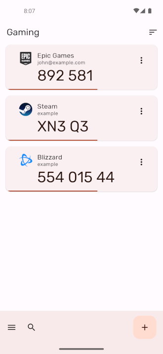
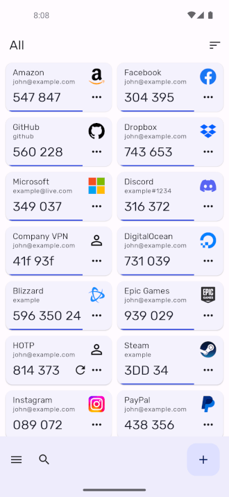
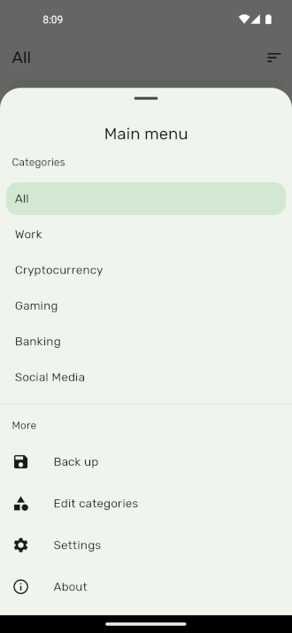
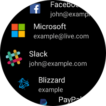
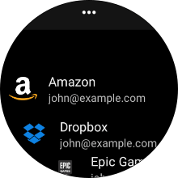
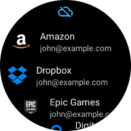

  

A free open-source two factor authentication app for Android. It features encrypted backups, icons, categories and a high level of customisation. It also has a Wear OS companion app.

It supports TOTP (Time Based) and HOTP (Counter Based) authenticators using either SHA1, SHA256 or SHA512 hashing algorithms. Mobile-Otp (mOTP), Steam and Yandex are also supported.

## Download ⬇️

> Authenticator Pro is currently only available on the F-Droid client through the [IzzyOnDroid repo](https://apt.izzysoft.de/fdroid/). You must first add this repository in the F-Droid client.

## Support development ❤️

## Quick Links 🔗

[Request Icons](https://github.com/jamie-mh/AuthenticatorPro/issues/new?assignees=&labels=enhancement&template=icon_request.md&title=)
 
[Frequently Asked Questions](https://github.com/jamie-mh/AuthenticatorPro/wiki#frequently-asked-questions)

[Contribution Guide](https://github.com/jamie-mh/AuthenticatorPro/blob/master/CONTRIBUTING.md)

[Backup File Format](https://github.com/jamie-mh/AuthenticatorPro/blob/master/doc/BACKUP_FORMAT.md)

### Importing from other apps:

[Google Authenticator](https://github.com/jamie-mh/AuthenticatorPro/wiki/Importing-from-Google-Authenticator)

[Blizzard Authenticator](https://github.com/jamie-mh/AuthenticatorPro/wiki/Importing-from-Blizzard-Authenticator)

[Steam](https://github.com/jamie-mh/AuthenticatorPro/wiki/Importing-from-Steam)

[Authy](https://github.com/jamie-mh/AuthenticatorPro/wiki/Importing-from-Authy)

## Features 🪄

⚙️ **Compatibility:** Authenticator Pro is compatible with most providers and accounts.
 
💾 **Backup / Restore:** Backup your authenticators with strong encryption. In case you lose your or change phone, you can always gain access to your accounts. Save to cloud storage or to your device.

🌙 **Dark Mode:** Authenticator Pro has a beautiful material design inspired look in either light or dark themes.

⏺️ **Icons:** Find your authenticators easily with recognisable brand logos and icons next to each code.

📂 **Categories:** Organise your authenticators into categories.

🔒 **Offline with few permissions:** Authenticator Pro only requires a single permission and does not require Internet access to function.

🎨 **Customisation:** Set icons and rename. You can also arrange your authenticators in any order you like so you can find them easily.

⌚ **Wear OS:** Quickly view your authenticators directly from your watch. Please note that a connection to your Android device is required.

## Screenshots 📱

  

### Wear OS Companion

## Permissions 🔒

* Camera permission is required to add accounts through QR codes.

## Disclaimer:

This program is free software: you can redistribute it and/or modify it under the terms of the GNU General Public License as published by the Free Software Foundation, either version 3 of the License, or (at your option) any later version.

This program is distributed in the hope that it will be useful, but WITHOUT ANY WARRANTY; without even the implied warranty of MERCHANTABILITY or FITNESS FOR A PARTICULAR PURPOSE. See the GNU General Public License for more details.
