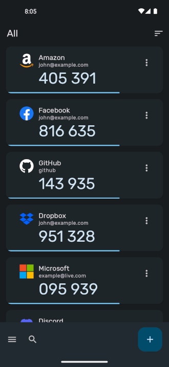
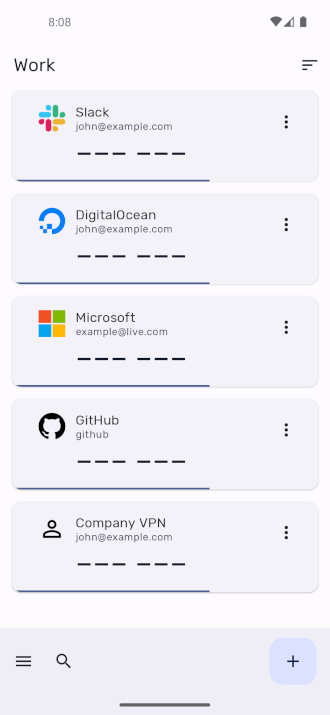

# Authenticator Pro

Authenticator Pro is a free open-source two factor authentication app for Android.
It supports TOTP (Time Based) and HOTP (Counter Based) authenticators using either SHA1, SHA256 or SHA512 hashing algorithms.

View some supported providers here: [Two Factor Auth List](https://twofactorauth.org/) (marked with "software token")

## Quick Links

[Contribution Guide](https://github.com/jamie-mh/AuthenticatorPro/blob/master/CONTRIBUTING.md)

[Backup File Format](https://github.com/jamie-mh/AuthenticatorPro/blob/master/doc/BACKUP_FORMAT.md)

## Download

Please note, Authenticator Pro is currently only available on the IzzyOnDroid F-Droid repo (https://apt.izzysoft.de/fdroid/). You must first add this repository in the F-Droid client.

## Features

* **Compatibility** : Authenticator Pro is compatible with most providers and accounts. View some supported providers here: https://twofactorauth.org/ (marked with "software token").

* **Backup / Restore** : Backup your authenticators with strong encryption. In case you lose your or change phone, you can always gain access to your accounts. Save to cloud storage or to your device.

* **Dark Mode** : Authenticator Pro has a beautiful material design inspired look in either light or dark themes.

* **Icons** : Find your authenticators easily with recognisable brand logos and icons next to each code.

* **Categories** : Organise your authenticators into categories.

* **Offline with few permissions** : Authenticator Pro only requires a single permission and does not require Internet access to function.

* **Customisation** : Set icons and rename. You can also arrange your authenticators in any order you like so you can find them easily.

* **Wear OS** : Quickly view your authenticators directly from your watch. Please note that a connection to your Android device is required.

## Screenshots

### Wear OS Companion

## Permissions

* Camera permission is required to add accounts through QR codes.
