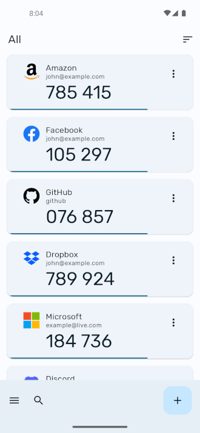
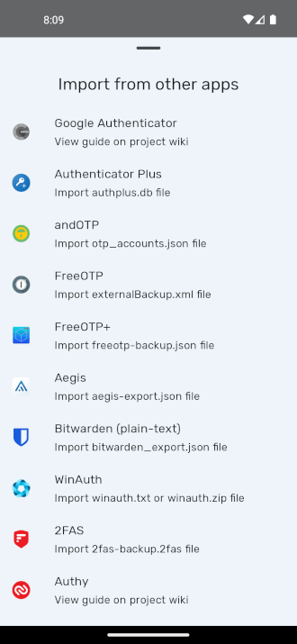

# Authenticator Pro

Authenticator Pro is a free open-source two factor authentication app for Android.

It supports TOTP (Time Based) and HOTP (Counter Based) authenticators using either SHA1, SHA256 or SHA512 hashing algorithms.

View some supported providers here: [Two Factor Auth List](https://twofactorauth.org/) (marked with "software token")

The app is written in C# with Xamarin Android.

## Download

## Features

* **Compatibility** : Compatible with most providers and accounts.

* **Backup / Restore** : Backup your authenticators with strong encryption. In case you lose your device, you can always gain access to your accounts. Save to cloud storage or to your device.

* **Very Secure** : All authenticators are stored securely on your device with an encrypted database. Even with root access your authentications cannot be stolen.

* **Fingerprint / Passcode / Pattern Authentication** : Lock access to your authenticators. On supported devices with a fingerprint reader, require the use a fingerprint to access your 2 factor codes.

* **Icons** : Find your authenticators easily with recognisable brand logos and icons next to each code.

* **Categories** : Organise your authenticators into categories.

* **Reordering** : Arrange your authenticators in any order you like so you can find them easily.

* **Beautiful Design** : Authenticator Pro has a beautiful material design inspired look. Also you can change the look of the app to either a light or dark theme.

* **Limited Permissions** : Authenticator Pro only uses basic permissions and does not require Internet access to function.

* **Adaptive Icon** : Authenticator Pro has an adaptive icon and will blend in on any device.

## Screenshots

## Permissions

* Storage Permission is required to save and load backup files from device storage.

* Camera permission is required to add accounts through QR codes.
